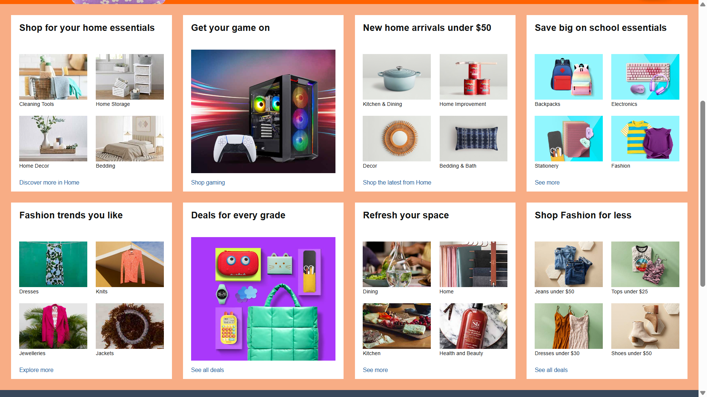

# E-Commerce Website Clone (HTML & CSS)

This is a fully responsive **Amazon-inspired e-commerce homepage** built using **pure HTML5 and CSS3**. The project replicates the layout of a modern e-commerce platform, including navigation bar, search bar, product sections, and footer, without using any external frameworks like Bootstrap or JavaScript.

---

## **Features**
- **Responsive Navigation Bar** with hover effects  
- **Search Bar** styled with custom icons (Font Awesome)  
- **Hero Section** with background banner  
- **Multiple Product Sections** using flexbox  
- **Hover Effects on Navigation & Product Panels**  
- **Custom Footer** with multiple informational sections  
- **No frameworks or libraries** – completely handcrafted in HTML & CSS  

---

## **Technologies Used**
- **HTML5** – Structure and semantic layout  
- **CSS3** – Styling, Flexbox for responsiveness  
- **Font Awesome** – Icons for search, location, and cart  

---

## **Project Structure**
```
├── index.html      # Main HTML file
├── style.css       # Styling file
├── images/         # (Contains background & product images)
└── README.md       # Documentation
```

---

## **How to Run Locally**
1. Clone this repository  
   ```bash
   git clone https://github.com/yourusername/amazon-clone.git
   ```
2. Open `index.html` in your browser.  

---

## **Screenshots**

### **Homepage Preview**


### **Product Section**


### **Footer Section**


*(Add your screenshots inside a `/screenshots` folder in the repo and replace the above links)*

---

## **Note**
This project is for **educational purposes only**. It does not use Amazon’s actual assets for commercial purposes. Replace images and branding before public deployment to comply with copyright laws.
